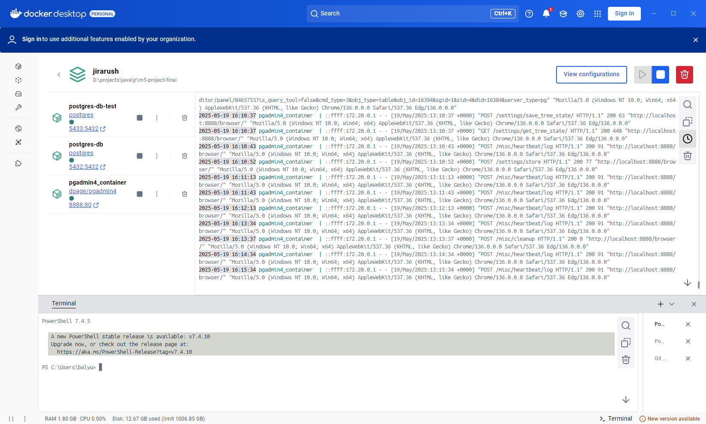
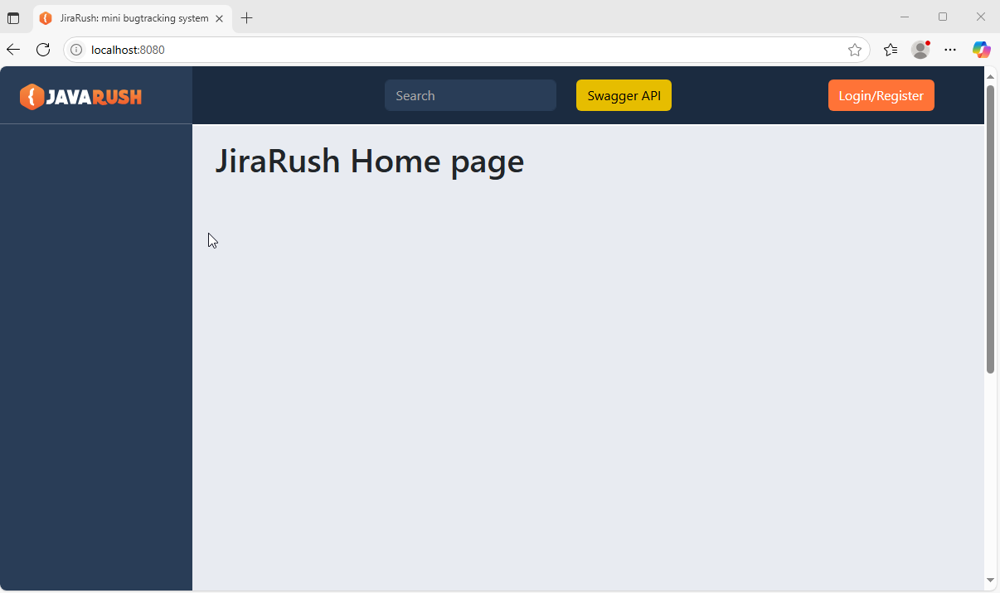
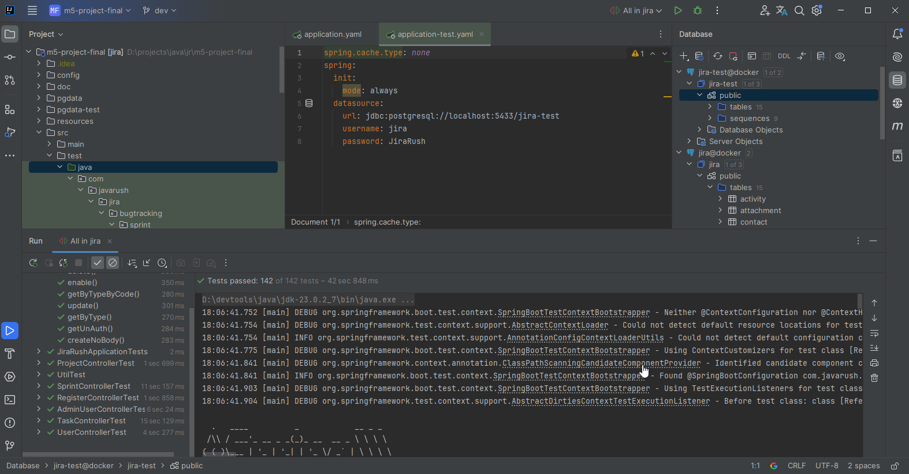
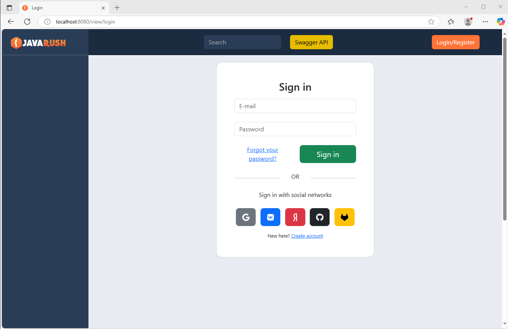
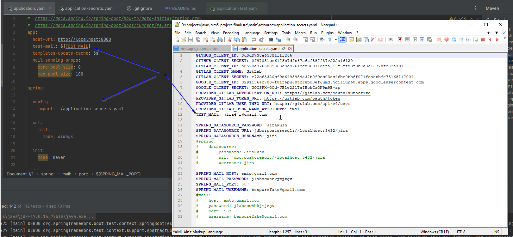
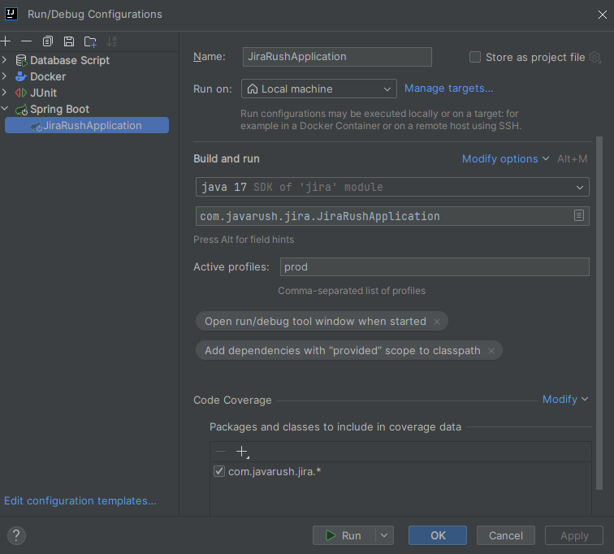
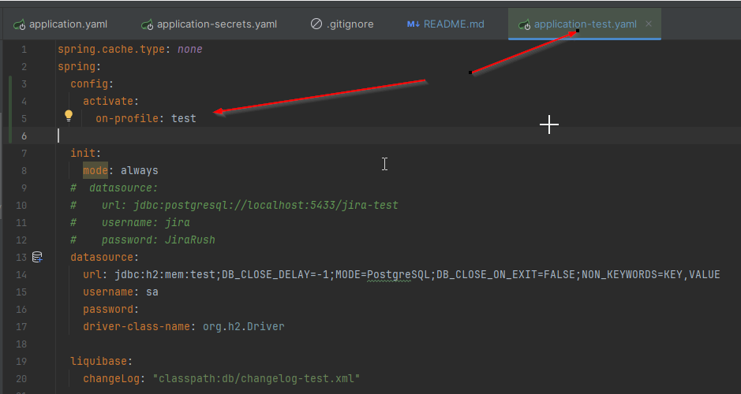
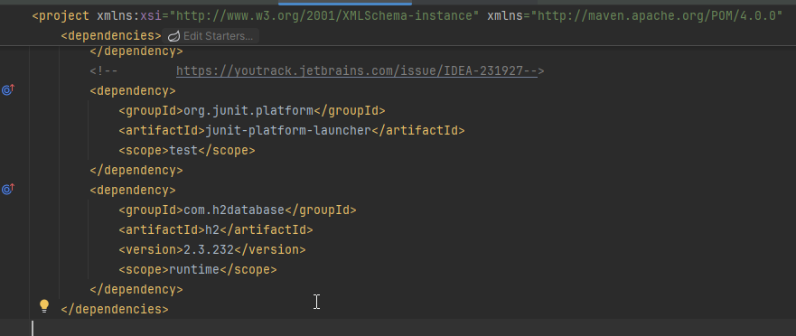
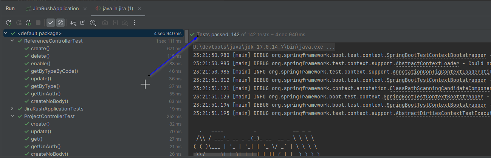
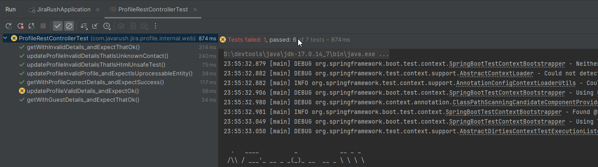

## [REST API](http://localhost:8080/doc)

```
  url: jdbc:postgresql://localhost:5432/jira
  username: jira
  password: JiraRush
```

<h2>List of completed tasks:</h2>

<p>&#10004;&#65039; 1. Understand the project structure (onboarding).</p>

<div align="center"><b>Run Docker</b></div>
<br>

<div align="center"><b>First running app</b></div>
<br>

<div align="center"><b>All Tests Running</b></div>
<br>
<p>&#10004;&#65039; 2. Remove social networks: vk, yandex.</p>

<div align="center"><b>Before</b></div>
<br>

<div align="center"><b>After</b></div>
<br>
<p>&#10004;&#65039; 3. Transfer sensitive information (login, database password, identifiers for OAuth registration/authorization, mail settings) to a separate property file application-secrets.yaml. Put link for that file in .gitignore</p>

<div align="center"><b>Application secret file</b></div>
<br>

<div align="center"><b>Config prod profile</b></div>
<br>

<div align="center"><b>Config test profile</b></div>
<br>
<p>&#10004;&#65039; 4. Correct the tests so that during the tests the in memory database (H2) is used, and not PostgreSQL. To do this, you need to define 2 beans, and the selection of which one to use should be determined by the active Spring profile.</p>

<div align="center"><b>Add dependency</b></div>
<br>

<div align="center"><b>All Tests Running</b></div>
<br>
<p>&#10004;&#65039; 5. Write tests for all public methods of the ProfileRestController controller.</p>

<div align="center"><b>Run ProfileRestController tests</b></div>
<br>